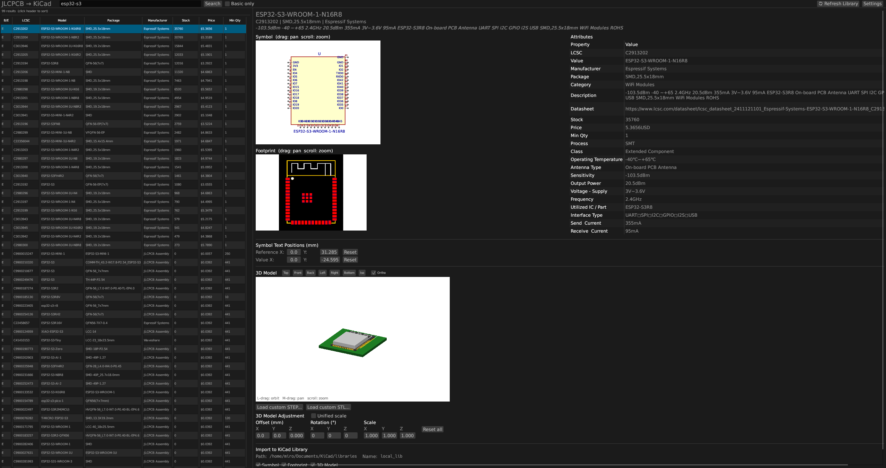
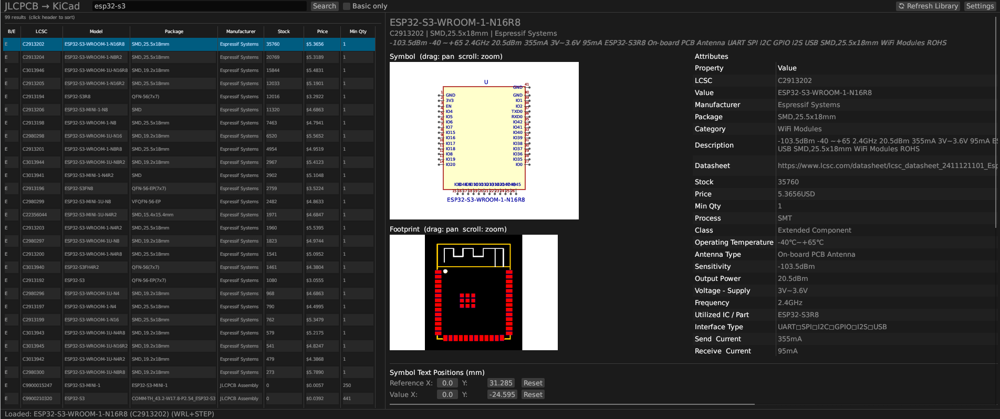
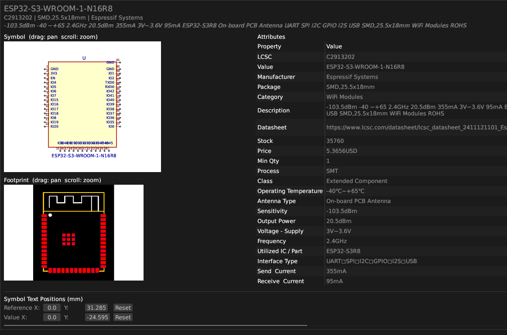
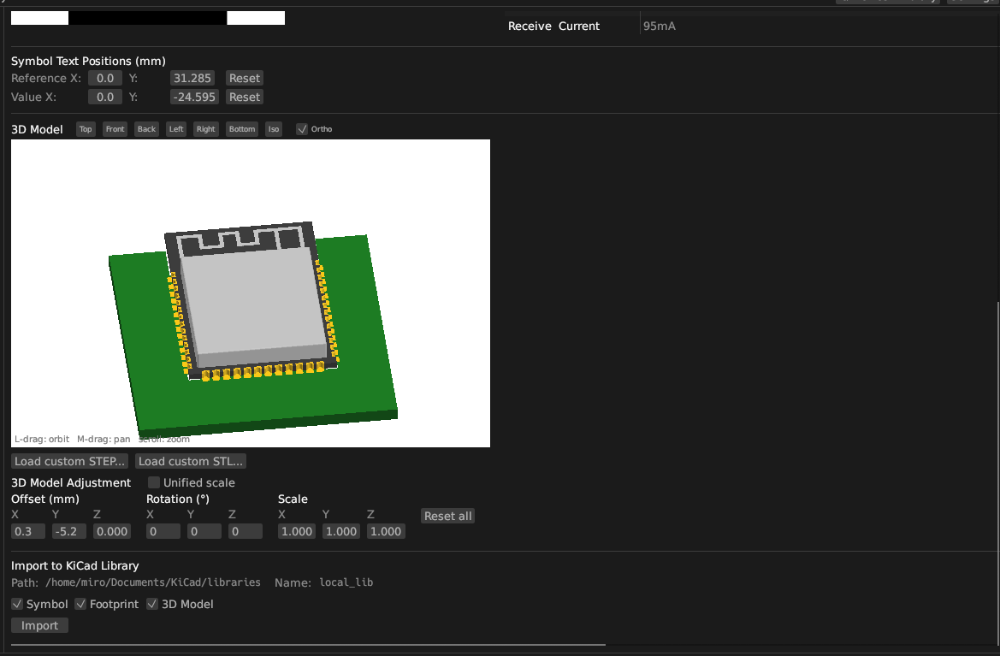

# JLCPCB → KiCad

A desktop app for browsing JLCPCB's parts catalog and importing components directly into a KiCad symbol/footprint library.

## Screenshots


*Search results with live symbol preview, footprint preview, and colored 3D model*


*Zoomable schematic symbol and PCB footprint side by side*


*Full component attributes panel — ESP32-S3-WROOM with symbol text position controls*


*Interactive 3D viewer (orbit, pan, zoom) with STEP color extraction and import controls*

## What it does

- Search JLCPCB's full parts database by keyword, value, LCSC number, or category (e.g. `ULN2003`, `100nF 0402`, `C7512`)
- Preview the KiCad schematic symbol and PCB footprint before importing
- View an interactive 3D model of the component on a PCB — supports colored WRL (from EasyEDA) and colored STEP (via [OpenCASCADE](https://dev.opencascade.org/))
- Load a custom STEP or STL file as the 3D model when none is available from JLCPCB
- Export a ready-to-use `.kicad_sym` symbol, `.kicad_mod` footprint, and 3D model (STEP + WRL) into your local KiCad library with one click

## Download

**AppImage** (recommended) — portable, no installation required:
- Download the latest `.AppImage` from [Releases](https://github.com/mirecta/jlcpcb-kicad-import/releases)
- Make executable: `chmod +x jlcpcb-kicad-*.AppImage`
- Run: `./jlcpcb-kicad-*.AppImage`

The AppImage includes all dependencies (OpenCASCADE, Rust runtime, etc.) — no setup needed!

## Building from Source

Requires:
- Rust (stable) — install via [rustup](https://rustup.rs)
- OpenCASCADE 7.8+ — for STEP file parsing with per-face colors

```bash
# Install OpenCASCADE
sudo apt-get install libocct-data-exchange-dev libocct-foundation-dev \
  libocct-modeling-data-dev libocct-modeling-algorithms-dev

# Build
git clone https://github.com/mirecta/jlcpcb-kicad-import
cd jlcpcb-kicad-import
cargo build --release
./target/release/jlcpcb-kicad
```

Or run directly:

```bash
cargo run --release
```

### Building AppImage

```bash
./build-appimage.sh
```

This creates a portable AppImage with all dependencies bundled.

## Usage

1. **Search** — type any query in the search bar and press Enter or click Search. Tick **Basic only** to limit results to JLCPCB's Basic Component library (no extra fee).
2. **Pick a part** — click any row to load the full component detail, symbol preview, footprint preview, and 3D model.
3. **Adjust placement** (optional):
   - Drag the symbol or footprint previews to pan; **Ctrl+scroll** to zoom.
   - Drag the 3D viewer to orbit; **middle-drag** to pan; scroll to zoom.
   - Adjust **3D Model Offset / Rotation / Scale** to fine-tune how the model sits on the footprint. Enable **Unified scale** to resize uniformly.
   - Load a **custom STEP** or **custom STL** if no 3D model is available.
4. **Configure library path** — click **Settings**, enter the path to your KiCad library folder and the library name.
5. **Import** — tick Symbol, Footprint, and/or 3D Model, then click **Import**.

After importing, register the library in KiCad:

- **Symbols:** Preferences → Manage Symbol Libraries → add `<lib_path>/<lib_name>.kicad_sym`
- **Footprints:** Preferences → Manage Footprint Libraries → add `<lib_path>/<lib_name>.pretty`
- **3D models:** add a path variable `<LIBNAME>_3D` pointing to `<lib_path>/<lib_name>.3dshapes`

## Output files

| File | Location |
|------|----------|
| Symbol | `<lib_path>/<lib_name>.kicad_sym` |
| Footprint | `<lib_path>/<lib_name>.pretty/<package>.kicad_mod` |
| 3D model (STEP) | `<lib_path>/<lib_name>.3dshapes/<package>.step` |
| 3D model (WRL) | `<lib_path>/<lib_name>.3dshapes/<package>.wrl` |

## Data sources

- Part metadata, pricing, and stock: [JLCPCB](https://jlcpcb.com/parts)
- Schematic symbols, footprints, and 3D models: [EasyEDA](https://easyeda.com) (LCSC component data)

## License

MIT
